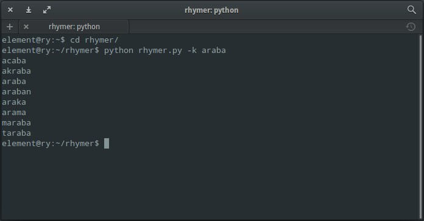

# rhymer
rhymer, find the nearest word is a word using levenshtein algorithm helps make the rhyme songwriter. Thanks [@ugurarici](https://github.com/ugurarici) for idea.

Live version: https://om3rcitak.github.io/rhymer/

# levenshtein algorithm 

https://en.wikipedia.org/wiki/Levenshtein_distance

# install
if not installed "requests" library
```sh
$ pip install requests
``` 
after installing "requests" library
```sh
$ git clone https://github.com/Om3rCitak/rhymer.git
``` 

# usage
```sh
$ python rhymer.py -k araba
``` 


# wordlist
all turkish words approved by the Türk Dil Kurumu and the recursive brute-force techniques save the wordlist_tdk.txt file.

if you want to update the wordlist
```sh
$ cp wordlist_tdk.txt wordlist_tdk_old.txt
$ python create_wordlist.py
```
this process will take slightly longer
##### OR

- Go https://tr.wiktionary.org
- Create a new book (https://tr.wiktionary.org/wiki/Özel:Kitap)
- Selected all char
- download book!

2k16, omercitak.com